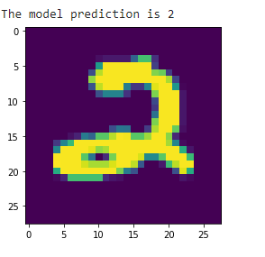
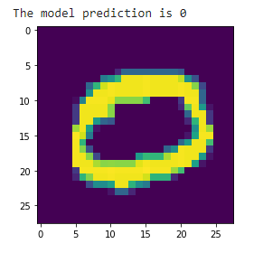
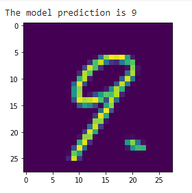

<h1>Digit Recognition Kaggle</h1>
<h3>I tried to use VGG19 and VGG16 architecture but they didn't perform as expected. I designed the cnn layers with custom parameters. My submission score is 0.96350 or 96.35% accuracy.</h3>
<h3>Competition: <a href="https://www.kaggle.com/c/digit-recognizer/" target="_blank">link</a></h3>

