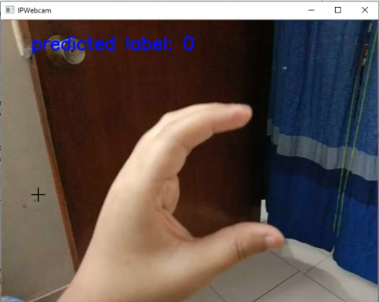
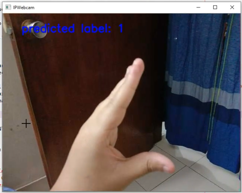
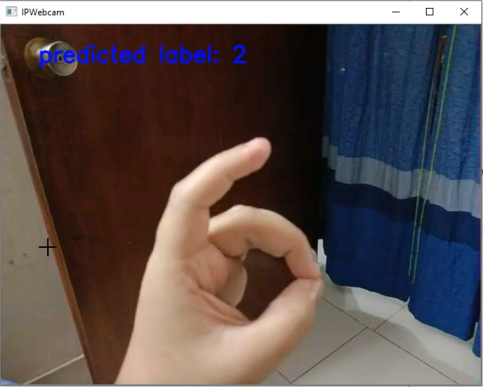
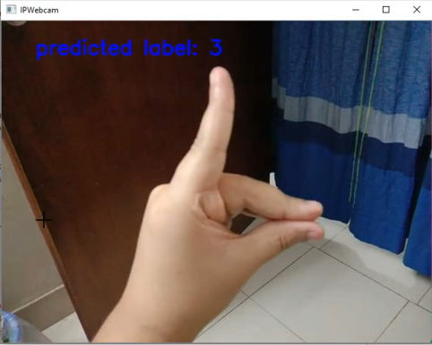
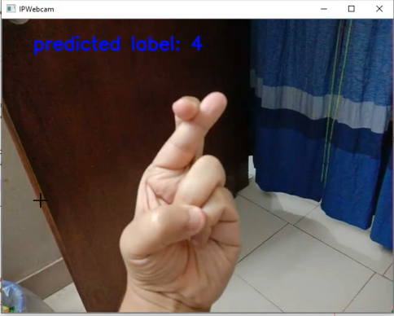

<h1>Bengali Hand Sign Recognition</h1>
<h3>Firstly VGG16 architecture was used. Later on found better results using VGG19 architecture.
Showing the video of VGG16 which has full details. After that the better results of VGG19 is shown.
</h3>

<h3>Dataset: <a href="https://www.kaggle.com/muntakimrafi/bengali-sign-language-dataset">link</a></h3>

<h3>VGG16 video results and further details of the dataset: <a href="https://drive.google.com/file/d/122nhslpaDd8GPEftuUM78gEfYuUrtdNL/view">link</a></h3>

<h3>VGG19 video results: <a href="https://drive.google.com/file/d/1KVs7-SqdHMVQNY9lmk6XF87LnkkvfN5D/view">link</a></h3>

<h3>Some images from the results of VGG19. Labels in the dataset were given in numerical values.</h3>

