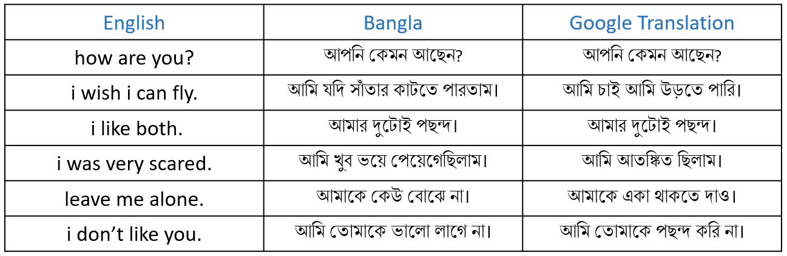

<h1>Encoder-Decoder with Attention (English to Bengali)</h1>
<h3>The code was modified to bidirectional LSTM Encoders from unidirectional GRU. Originally the code was from <a href="https://www.tensorflow.org/tutorials/text/nmt_with_attention">here.</a></h3>
<h3>Some results from the model</h3>
